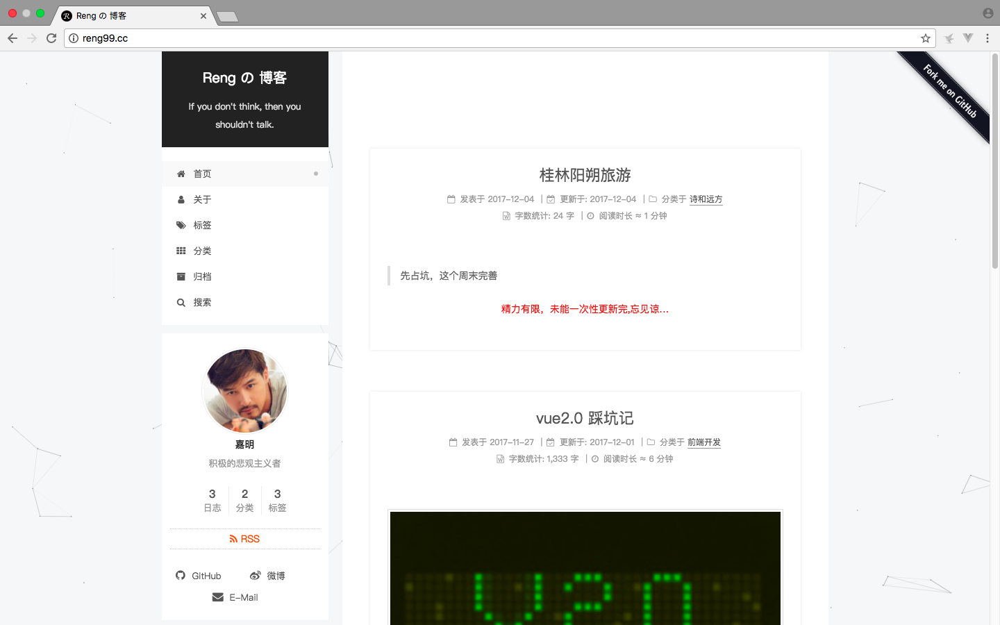

本博客效果如下：

详情请点击[reng99.cc](http://reng99.cc/)

下面为自己打个广告 😊

## 关于我

> 前言

Hello，见者好:blush:!我是嘉明(<del>哈哈@～@，套近乎。</del>全名庞嘉明)，是一个`web前端开发工程师`。本人毕业于[广东工业大学](http://www.gdut.edu.cn/)计算机学院软件工程专业,在校期间获得过校优秀学生二三等奖学金，参加过非技术的校级比赛并获得二等将，担任过某会的主席，获得过若干部门称号和其他奖项。目前就职于[广州趣丸网络科技有限公司（简称：TT游戏）](https://www.52tt.com/)的研发中心部门，支持TT语音移动端前端业务等其他。

> 自我介绍

- 学历 : <del>广东某和尚庙</del>某工业大学计算机学院软件工程（本科）

- 英文等级 : CET-6（具备一定的英文文献阅读能力）

- 求职意向 : 前端开发工程师(入坑两年有余)

- 联系方式 : 18819473489(电话，微信)  1837895991@qq.com(邮箱)

- 期望就职地点 : 广州(优先考虑)、深圳、杭州

- 发展路径 : 向着端工程师进发中

- 左右铭 : 感恩的心做人，奋斗的心做事

- 爱好 : [日常维护自己的github项目](https://github.com/reng99)、[编写blog](http://reng99.cc/)、慢跑、影音书、[旅行](http://reng99.cc/categories/%E8%AF%97%E5%92%8C%E8%BF%9C%E6%96%B9/)等

> 具备技能

1. 熟练掌握 <del>(本想不害臊的写精通)</del> HTML、CSS，熟悉页面架构和布局。对HTML5/CSS3等技术有一定的了解，熟悉使用less预处理器进行前端开发

2. 熟悉前后端分离开发，熟悉resful

3. 掌握前端开发常用的框架库类，如jquery，能基于框架写扩展应用

4. 有mvvm框架开发经验([vue](https://github.com/reng99/webapp)),有[移动h5开发经验](https://github.com/reng99/webapp)

5. 熟悉前端自动化[webpack](https://github.com/reng99/webpack)、[gulp](https://github.com/reng99/express_project)等，了解[nodejs](https://github.com/reng99/express_project)

6. 对css/javascript性能优化，能解决一定的浏览器兼容性问题

7. 对用户体验、交互操作流程和用户需求等有一定的了解

8. 有强烈的上进心和求知欲，善于学习和运用新知识，善于沟通和逻辑表达（在学校社团混三年，这沟通和表达能力还是ok的），有强烈的团队意识和执行力

> 工作经验 & 项目经验

* 任职公司 : [广州趣丸网络科技有限公司（简称：TT游戏）](https://www.52tt.com/) 2016.12至今
    * 所属部门 : 研发中心
    * 担任角色 : 前端开发工程师
        * 事件1 : 支持公司主要业务TT语音模块，可看[TT官网介绍](https://www.52tt.com/)2017.06至今
        * 技术支持1 : webpack、html/5、css/3、javascript、vue框架等
        * 事件2 : 参与开发淘米淘手游交易平台m端，项目被停，无网上链接，可查看[我的github源代码和效果](https://github.com/reng99/webapp)(2017.11至2017.12.18，前端三人)
        * 技术支持2 : webpack、html/5、css/3、javascript、jQuery、vue框架 等
        * 事件3 : 开发[淘米淘手游网站pc端](https://www.taomitao.com/)(2017.07~2017.11.03版本一，前端自己挑起)
        * 技术支持3 : webpack、gulp、html/5、css/3、javascript、jQuery库 等
        * 事件4 : 参与开发工单系统,是公司内部项目，没有相关链接提供。(2017.03至2017.06)
        * 技术支持4 : webpack、gulp、html、css、javascript、adminlte、vue框架（vue,vue-router,vuex全家桶）、underscore 等
        * 事件5 : 使用cms改写[pc端的TT官网](https://www.52tt.com/)
        * 技术支持5 : html、css、javascript、cms 等
* 任职公司 : [科友集团--广州科友](http://www.kejizx.com/) 2016.05~2016.11
    * 所属部门 : 软件开发部
    * 担任角色 : 前端开发工程师
        * 事件 : 参与开发[科技咨询服务平台](http://gz.kjzxfw.com/)
        * 技术支持 : html、css、javascript、库jQuery、php、snv、精灵图等

> 自我评价 

- 负责 : 严以律己、积极进取

- 团结 : 注重协作、团队精神

- 友善 : 待人真诚、乐于助人

- 踏实 : 做事稳重、着眼当下

- 爱生活 : 既然选择了远方，便只顾风雨兼程

> 后话

如果看者觉得愚某还ok，请别吝啬你的橄榄枝哦--邮箱837895991@qq.com(请别打电话，有可能编码的小灵感走失哦～)🙏 。对了，详细的关于我的介绍请看我[个人博客--关于我](http://reng99.cc/about/)❤️

另外，如果看者想交个朋友的话，可以加个`微信朋友`呗！`加的时候请备注下您的姓名和地区`，谢谢啦！

如果你觉得我的仓库还ok的话，那客官且留步，`微信`打赏下呗<del>(超厚脸皮的)</del>

